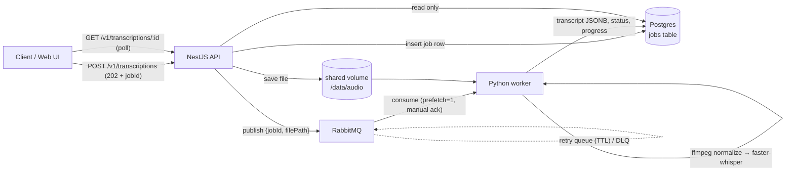
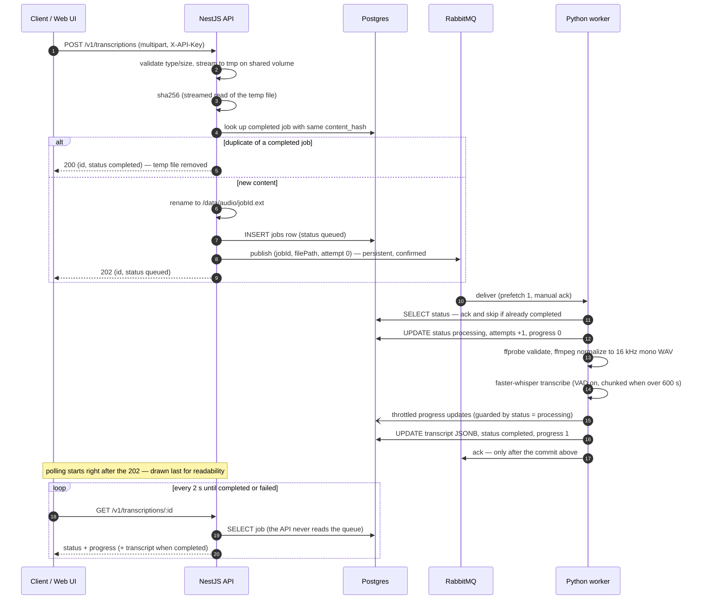
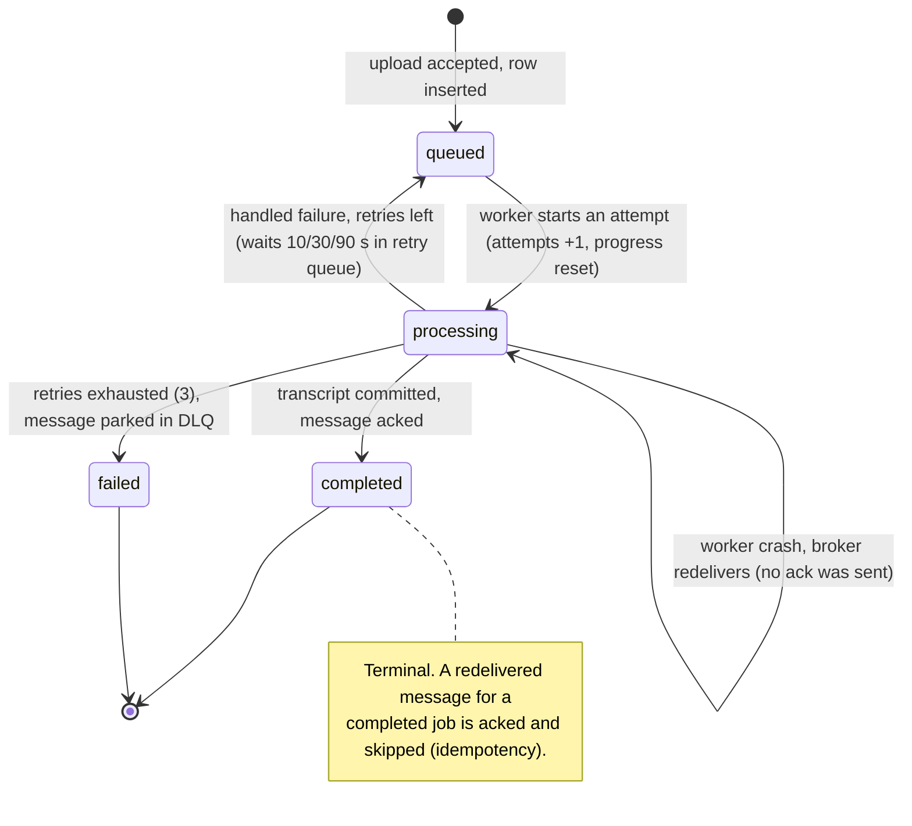

# ScribeFlow

Event-driven audio transcription platform. Upload an audio file via a REST API, get a job ID back immediately, and poll for the result: a full transcription with per-segment timestamps, exportable as JSON, SRT, or VTT. A minimal web UI wraps the same flow with drag-drop upload and a live progress bar.

The core design principle: **the API never does heavy work.** Upload handling and transcription are decoupled through RabbitMQ so each side can fail, retry, and scale independently.



Job state lives in **Postgres, not RabbitMQ** — messages are transient work signals; the `jobs` table is the source of truth.

### Request lifecycle



### Job state machine



## Quickstart

```bash
git clone <repo-url> scribeflow && cd scribeflow
cp .env.example .env
docker compose up --build
```

First build downloads the whisper `small` model (~460 MB) into the worker image; runtime is fully offline.

| Service | URL |
|---|---|
| API | http://localhost:3000 (Swagger UI at [/docs](http://localhost:3000/docs)) |
| Web UI | http://localhost:3001 |
| RabbitMQ management | http://localhost:15672 (credentials in `.env`) |
| Postgres | localhost:5434 (host port; in-network `postgres:5432`) |

### Try it

Upload the bundled sample (all `/v1` endpoints need the `X-API-Key` header from `.env`):

```bash
curl -H "X-API-Key: dev-secret-key" -F file=@samples/sample.mp3 \
  http://localhost:3000/v1/transcriptions
```
```json
{"id":"85082862-fa7d-4251-bb76-501badcecf80","status":"queued"}
```

Poll until completed (~20 s for the 31 s sample on CPU):

```bash
curl -H "X-API-Key: dev-secret-key" \
  http://localhost:3000/v1/transcriptions/85082862-fa7d-4251-bb76-501badcecf80
```
```json
{
  "id": "85082862-fa7d-4251-bb76-501badcecf80",
  "status": "completed",
  "originalName": "sample.mp3",
  "language": "en",
  "durationSec": 31.28,
  "progress": 1,
  "attempts": 1,
  "createdAt": "2026-07-10T20:32:01.721Z",
  "updatedAt": "2026-07-10T20:32:26.239Z",
  "transcript": {
    "text": "Welcome to ScribeFlow, an event-driven audio transcription platform. ...",
    "language": "en",
    "duration": 31.28,
    "segments": [
      { "id": 0, "start": 0, "end": 4.9, "text": "Welcome to ScribeFlow, an event-driven audio transcription platform." },
      { "id": 1, "start": 4.9, "end": 8.62, "text": "This short sample exists to exercise the pipeline end-to-end." }
    ]
  }
}
```

Export subtitles:

```bash
curl -OJ -H "X-API-Key: dev-secret-key" \
  "http://localhost:3000/v1/transcriptions/<id>/export?format=srt"
```
```
1
00:00:00,000 --> 00:00:04,900
Welcome to ScribeFlow, an event-driven audio transcription platform.
```

Re-uploading a byte-identical file returns the existing completed job (`200` instead of `202`) — dedup by content hash.

## API reference

All endpoints require `X-API-Key` except `/health`. Errors use the standard envelope `{ statusCode, error, message }`.

| Method & path | Description | Responses |
|---|---|---|
| `POST /v1/transcriptions` | Multipart upload, field `file`. Extensions: wav, mp3, m4a, flac, ogg, webm. Max 200 MB. | `202` queued · `200` dedup hit · `400` no file · `413` too large · `415` bad type |
| `GET /v1/transcriptions/:id` | Job status + metadata; `transcript` when completed, `error` when failed | `200` · `400` malformed id · `404` unknown |
| `GET /v1/transcriptions/:id/export?format=srt\|vtt` | Subtitle download (default `srt`) | `200` · `400` bad format · `404` · `409` not completed |
| `GET /v1/transcriptions?limit&offset` | Paginated list, newest first, transcripts omitted | `200` |
| `GET /health` | `{status: ok}` when Postgres + RabbitMQ reachable (no auth) | `200` · `503` with per-dependency detail |

The queue contract between API and worker is documented in [shared/message-schema.md](shared/message-schema.md).

## Design decisions

**Why an event-driven API/worker split.** Transcription is minutes of CPU-bound work; an upload request should take milliseconds. The API validates, stores, records, publishes, and returns `202`. Upload spikes become queue depth instead of API latency, the worker can crash without losing accepted work, and each side scales on its own axis (API: connections; worker: cores).

**Why RabbitMQ instead of a Redis-backed queue (BullMQ/Celery).** Three broker-level features do the heavy lifting here: (1) manual acks with automatic redelivery give crash recovery with zero application code; (2) native dead-letter exchanges and per-message TTL implement retry-with-backoff and a DLQ declaratively; (3) AMQP is a language-neutral wire protocol, so the TypeScript producer and Python consumer share a documented contract rather than a client library. A Redis queue couples both sides to one library ecosystem and re-implements ack/retry semantics in application code.

**Why NestJS + Python (polyglot).** TypeScript/NestJS gives the API layer typed DTO validation, guards, and generated Swagger for free. Python owns the ML side because faster-whisper/CTranslate2 live there. The queue makes the language boundary a designed seam: each service is idiomatic in its own ecosystem and the contract between them is three JSON fields.

**Why normalize all audio through ffmpeg.** Uploads arrive as any container/codec. `ffprobe` validates (audio stream present, duration known) and rejects garbage with a precise error; `ffmpeg` converts everything to one canonical format (16 kHz mono s16 WAV — what whisper consumes anyway). Everything downstream handles exactly one input shape, and "does this file decode?" is answered before any GPU/CPU time is spent.

**Why faster-whisper.** Open-source and fully local (a hard constraint here), native per-segment timestamps (no post-hoc alignment), and CTranslate2 int8 inference runs near real-time on CPU — `small` transcribed 31 s of speech in ~20 s in these tests. Model size is env-configurable (`WHISPER_MODEL`).

**How chunking + timestamp offsetting works.** Files longer than `CHUNK_THRESHOLD_SEC` (600) are split into `CHUNK_SEC` (300) pieces from the *normalized* WAV. Chunks are transcribed sequentially; each chunk's segment timestamps are shifted by the chunk's start offset, then all segments are renumbered globally. Real numbers from an 11-minute test file:

```text
normalized WAV, 657.4 s        (threshold 600 s exceeded → 300 s chunks)
├── chunk 0  [   0 – 300   ]  →  77 segments, timestamps already global
├── chunk 1  [ 300 – 600   ]  → 121 segments, offset each by +300 s
└── chunk 2  [ 600 – 657.4 ]  →  10 segments, offset each by +600 s

chunk 1's first raw segment   (0.0 s → 3.0 s)
   after offset_segments(+300)  (300.0 s → 303.0 s)
merge_chunks → renumber ids 0…207 → one monotonic global timeline
```

The math lives in pure functions (`plan_chunks`, `offset_segments`, `merge_chunks`) with dedicated tests — the file above produced monotonic timestamps across both chunk boundaries. Progress is reported as `(chunks_done + within-chunk fraction) / total`. Cuts are fixed-boundary; whisper's VAD absorbs most mid-word seams (see Limitations).

**Why job state lives in Postgres, not the broker.** Messages get redelivered, expired, dead-lettered, and duplicated — none of that may corrupt what a client sees. The API reads only Postgres; the queue is a work signal. This also makes idempotency trivial: a redelivered message for a `completed` job is acked and skipped.

**How retry / DLQ / crash recovery works.** Two failure classes, two mechanisms. *Handled errors* (bad audio, ffmpeg failure): the worker republishes the message to a TTL retry queue with an incremented `x-retry-count` header — delays 10 s / 30 s / 90 s — and after 3 retries parks it in `transcription.dead` and marks the job `failed` with the error text. *Crashes*: the worker acks only after the transcript is committed, so a killed worker's message is redelivered automatically and reprocessed from scratch. `attempts` counts every processing start. Poison messages (malformed JSON, non-UUID job ids, unknown jobs) go straight to the DLQ for inspection.

**Why `prefetch=1`.** Jobs run minutes each. Prefetching more would make one worker hoard messages it can't process (starving any future siblings) and lose more in-flight work per crash. One-at-a-time delivery gives fair dispatch and bounds crash damage to a single redelivered job.

### System design answers

*The assessment's Part 2 questions, answered directly:*

**How would you handle concurrent uploads?** The upload path is I/O-bound and non-blocking: multer streams to disk (never RAM — 200 MB uploads don't buffer), sha256 is computed by streaming, then one row insert and one publish. Node's event loop handles many concurrent uploads on one instance; the API is stateless, so horizontal scaling behind a load balancer is trivial. Crucially, concurrency in *uploads* never becomes concurrency in *transcription* — that pressure lands in the queue as depth, which workers drain at their own pace. Content-hash dedup also collapses identical concurrent workloads.

**How would you store audio and transcripts?** Audio: files on a shared volume named `<jobId>.<ext>`; queue messages carry *paths, never bytes*. Transcripts: JSONB on the `jobs` row — one fetch serves the polling endpoint, no joins, and segments stay queryable. In production, audio moves to object storage (S3) with presigned upload/download URLs; the transcript model is unchanged.

**How do you retry or recover failed transcriptions?** See "How retry / DLQ / crash recovery works" above: TTL-backoff retry queue (10/30/90 s) for handled errors, broker redelivery + idempotent reprocessing for crashes, DLQ for exhausted and poison messages, `attempts` and `error` recorded on the job row. All of this was drill-tested (kill -9 mid-job, deleted input files, corrupted headers).

**How would you expose this as an API?** REST under `/v1` with the async-job pattern: `POST` returns `202 + id` immediately, clients poll `GET /:id` (the UI polls every 2 s), export endpoints render derived formats. Static API key via header, consistent error envelope, OpenAPI at `/docs`. At production scale, webhooks/callbacks replace polling (see below).

**How do you deal with long audio files?** See "How chunking + timestamp offsetting works" above — threshold-triggered fixed-size chunking with per-chunk timestamp offsetting, global renumbering, and incremental progress the client can display.

## Production path

What changes beyond a single-host deployment, in rough order:

- **Object storage instead of a shared volume** — clients upload via presigned S3 URLs (the API never proxies bytes), workers fetch by key, lifecycle rules expire raw audio.
- **Managed broker** (Amazon MQ / CloudAMQP) with the same topology, per-environment vhosts, and alerting on DLQ depth.
- **Autoscaled workers** — queue-depth-driven scaling (e.g. KEDA on RabbitMQ depth), GPU nodes with larger whisper models; `prefetch=1` already makes work distribution fair.
- **Observability** — Prometheus metrics (queue depth, job duration, failure/retry rates), log aggregation keyed on the `jobId` already present in every log line, alerting on DLQ arrivals.
- **API hardening** — per-client API keys with quotas and rate limiting, request size limits at the ingress, TypeORM migrations instead of `synchronize`.
- **Webhooks** — clients register a callback URL per job; polling stays as fallback.
- **DLQ tooling** — a replay command that re-publishes dead messages after a fix ships.

## Limitations

- `synchronize: true` manages the schema (fine for dev/demo; production wants migrations).
- Chunk cuts are fixed-boundary: a word straddling a 300 s boundary can be clipped or duplicated; whisper's VAD mitigates but doesn't eliminate this. Overlapped chunks with segment reconciliation would fix it at the cost of duplicate-merging logic.
- The single retry queue uses per-message TTL, which has head-of-line blocking: a 10 s retry queued behind a 90 s head expires late. Per-TTL queues would remove it.
- One static API key; no per-client identity, quotas, or rate limiting.
- Polling only; no webhooks.
- Scale-out of workers is safe (broker distributes, ack semantics hold) but two *concurrent identical* uploads can both transcribe — dedup only matches already-completed jobs.
- Whisper `small` trades accuracy for CPU speed; swap `WHISPER_MODEL` for better quality on capable hardware.

## Running tests

```bash
# API (Jest) — 34 unit + 1 e2e
cd api && npm ci && npm test && npm run test:e2e

# Worker (pytest, needs Python 3.11 + ffmpeg) — 34 tests, model never loaded
cd worker && pip install -r requirements-dev.txt && ruff check . && pytest
# ...or without a local Python 3.11, inside the built image:
docker run --rm -v $PWD/worker:/w -w /w scribeflow-worker \
  sh -c "pip install -q -r requirements-dev.txt && ruff check . && pytest"

# Web (lint + type-checked build)
cd web && npm ci && npm run lint && npm run build
```

CI runs all three suites on every push/PR (`.github/workflows/ci.yml`).
