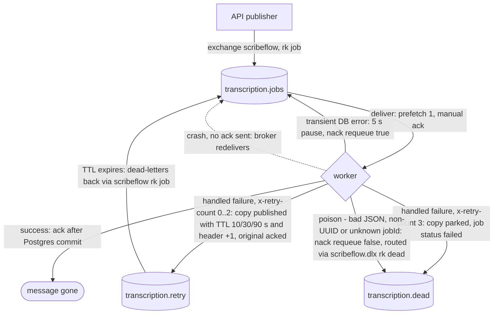

# Queue Contract

Contract between the NestJS API (producer) and the Python worker (consumer). Both services declare the topology below idempotently on startup; declarations must stay identical on both sides.

## Message: transcription job

Published by the API to exchange `scribeflow` with routing key `job` after the upload is stored and the job row is inserted.

```json
{
  "jobId": "550e8400-e29b-41d4-a716-446655440000",
  "filePath": "/data/audio/550e8400-e29b-41d4-a716-446655440000.mp3",
  "attempt": 0
}
```

| Field | Type | Description |
|---|---|---|
| `jobId` | UUID string | Primary key of the `jobs` row in Postgres |
| `filePath` | string | Absolute path on the shared `/data/audio` volume |
| `attempt` | integer | Delivery attempt counter, starts at 0 |

Messages are persistent (delivery mode 2) and contain **paths only — never audio bytes**. Files travel via the shared Docker volume.

## Topology

```
Exchange: scribeflow (direct, durable)
Exchange: scribeflow.dlx (direct, durable)

Queue: transcription.jobs   ← bind scribeflow / rk "job"
  x-dead-letter-exchange:    scribeflow.dlx
  x-dead-letter-routing-key: dead

Queue: transcription.retry  ← bind scribeflow / rk "retry"
  x-dead-letter-exchange:    scribeflow
  x-dead-letter-routing-key: job        # expired messages re-enter the work queue
  (delay via per-message `expiration`, set by the worker per attempt)

Queue: transcription.dead   ← bind scribeflow.dlx / rk "dead"
  (parked messages for manual inspection; no consumer)
```

## Retry semantics

The worker uses **manual acks** with `prefetch_count = 1` and acks only after
the result is committed to Postgres.

On a handled failure the worker reads the `x-retry-count` header (default 0):

| `x-retry-count` | Action |
|---|---|
| 0 | republish to `transcription.retry` with per-message TTL **10s**, header → 1, ack original |
| 1 | republish with TTL **30s**, header → 2, ack original |
| 2 | republish with TTL **90s**, header → 3, ack original |
| ≥ 3 | publish copy to `transcription.dead`, set job `status=failed` + `error`, ack |

Expired retry messages dead-letter back into `transcription.jobs` and are
consumed again. `jobs.attempts` counts processing attempts (incremented each
time the worker starts a job, including crash redeliveries).

**Crash recovery:** if the worker dies before acking, the broker redelivers
the message automatically. Processing is idempotent — a job whose status is
already `completed` is acked and skipped on redelivery.

**Poison messages** (unparseable JSON, non-UUID `jobId`, unknown job, corrupted
`x-retry-count`) are parked in `transcription.dead` immediately — they are
never retried. Transient infrastructure failures (database unreachable) are
requeued with a short delay instead.

**Known limitation:** per-message TTL on a single retry queue is subject to
head-of-line blocking (a message behind a longer-TTL head expires late).
Acceptable at this scale; a fixed-TTL-per-queue layout would remove it.

## Message journey on failure



Solid lines are explicit worker actions; the dashed line is the broker-driven
crash-recovery path that needs no application code.
